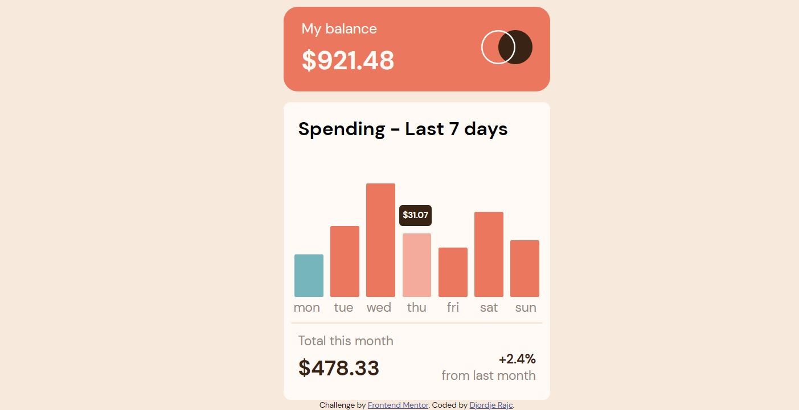

# Frontend Mentor - Expenses chart component solution

This is a solution to the [Expenses chart component challenge on Frontend Mentor](https://www.frontendmentor.io/challenges/expenses-chart-component-e7yJBUdjwt). Frontend Mentor challenges help you improve your coding skills by building realistic projects. 

## Table of contents

- [Overview](#overview)
  - [The challenge](#the-challenge)
  - [Screenshot](#screenshot)
  - [Links](#links)
- [My process](#my-process)
  - [Built with](#built-with)
  - [What I learned](#what-i-learned)
  - [Continued development](#continued-development)
- [Author](#author)


## Overview

### The challenge

Users should be able to:

- View the bar chart and hover over the individual bars to see the correct amounts for each day
- See the current day’s bar highlighted in a different colour to the other bars
- View the optimal layout for the content depending on their device’s screen size
- See hover states for all interactive elements on the page
- **Bonus**: Use the JSON data file provided to dynamically size the bars on the chart

### Screenshot




### Links

- Solution URL: (https://www.frontendmentor.io/solutions/mobilefirst-workflow-expenses-chart-component-B1ZggLbbQw)
- Live Site URL: (https://blurryface1998.github.io/expenses-chart-component-main/)

## My process

### Built with

- Semantic HTML5 markup
- CSS custom properties
- Flexbox
- Mobile-first workflow
- JavaScript

### What I learned

I learned how to use new Date() to get weekday so I can put an active class to the appropriate div element.
I didn't know how to use Chart.js to create a Bar Chart so I used HTML and CSS to create a simple Chart.

```html
<section class="main__graph">
  <div class="amounts" style="height: 30%;"></div>
  <div class="amounts" style="height: 50%;"></div>
  <div class="amounts" style="height: 80%;"></div>
  <div class="amounts" style="height: 45%;"></div>
  <div class="amounts" style="height: 35%;"></div>
  <div class="amounts" style="height: 60%;"></div>
  <div class="amounts" style="height: 40%;"></div>
</section>
```

```css
.amounts {
  display: inline-block;
  width: 10%;
  padding: rem(10);
  background-color: var(--softRed);
  margin: 0 rem(4.9);
  border-radius: 2px;

  @include breakpoint(xlarge) {
    width: 11%;
    margin: 0 rem(3.3);
  }

  &:hover {
    opacity: 0.6;
    cursor: pointer;
    transition: all 0.2s ease-in;
  }
}
```

```js
switch(new Date().getDay()) {
    case 0:
      element[6].classList.add("active");
      break;
    case 1:
      element[0].classList.add("active");
      break;
    case 2:
      element[1].classList.add("active");
      break;
    case 3:
      element[2].classList.add("active");
      break;
    case 4:
      element[3].classList.add("active");
      break;
    case 5:
      element[4].classList.add("active");
      break;
    case 6:
      element[5].classList.add("active");
      break;
}
```
### Continued development

I'll focus on learning how to properly use and stylize Chart.js or other open-source graphs library. 

## Author

- Website - [Djordje Rajc]
- Frontend Mentor - [@Blurryface1998](https://www.frontendmentor.io/profile/Blurryface1998)
- Twitter - [@Blurryface_1998](https://twitter.com/Blurryface_1998)
